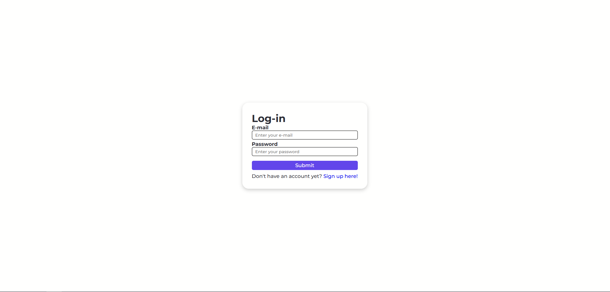
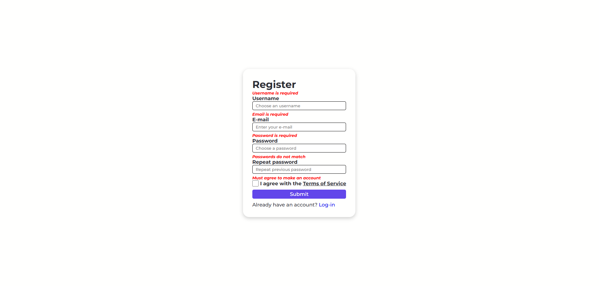
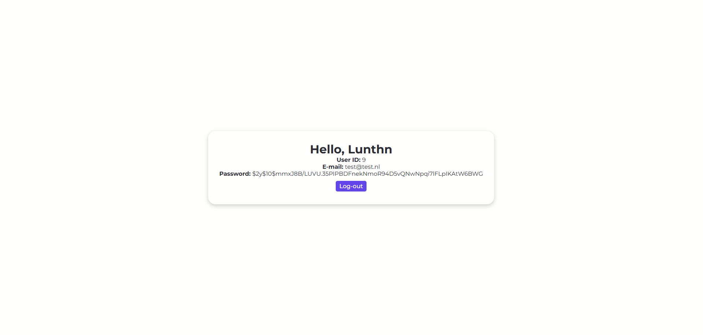

# Login-registration-form 
This login/registration form was created for a small school project to help me learn PHP. It includes basic features like email and username uniqueness checks, as well as password hashing. If you intend to use this, ensure the database is correctly connected in the [database.php](https://github.com/Lunthn/Login-registration-form/blob/main/database.php) file and you use the [users.sql](https://github.com/Lunthn/Login-registration-form/blob/main/users.sql) file.

Cropped screenshots (click on the image for a larger view):

 
 

 
 

 
 

 
 

 
 

